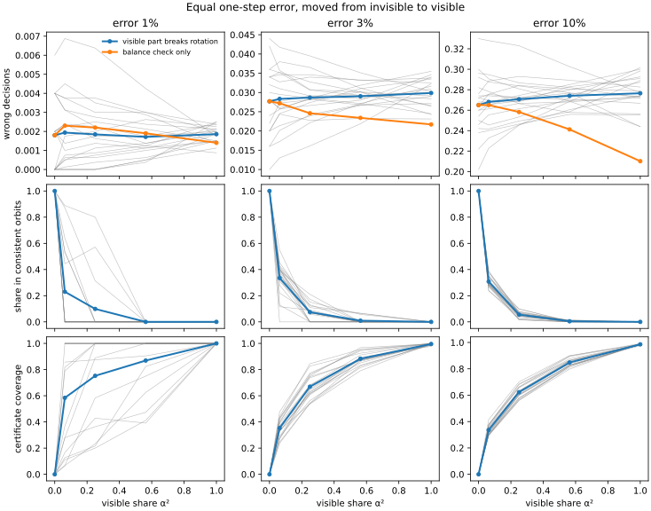
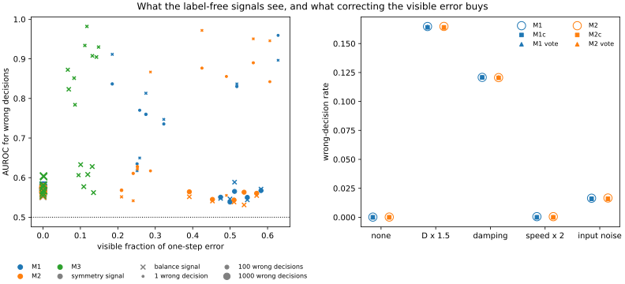

# InvariantLens

[](https://github.com/nefeMLi/InvariantLens/actions/workflows/tests.yml)

A world model predicts what happens next, and an agent uses those predictions to decide what to do. When the model
is wrong, can anything tell, without access to the right answer? I wanted to know how much of a world model's error
can be seen from the model alone, what that visible part does to the agent's decisions, and what is left once you
remove it.

The idea is simple. The true physics follows rules I know in advance. Turn the whole scene and the outcome turns with
it, and the total momentum and centre of mass change by amounts fixed by the push. Any part of the model's error that
breaks those rules can be measured from the model alone, by asking it the same question in different ways. Any part
that follows the rules can't be seen without the true simulator. The split between the two is exact, and the visible
part can even be subtracted.

I wrote down what I expected before training any model, in [HYPOTHESES.md](HYPOTHESES.md). Some predictions were
added later, and one bug was fixed after the results were in. The log at the end of that file says what I had seen
at each point, and the git history shows when each prediction was committed.

## What I tested

The test bed is a small 2D push task where I know the exact answer. Five discs attract and repel each other. The
agent pushes one of them, and has to knock a target disc towards a goal. In each situation it picks the best of five
candidate pushes using the world model's predictions. Since I can simulate every candidate for real, I know every
time it picks wrong.

Every situation also comes in 16 copies, rotated by multiples of 22.5°. The right answer is the same in all 16. That
gives a check that needs no labels: if the model picks different pushes for rotated copies of the same situation,
some of those picks must be wrong.

There are two experiments.

- **Controlled.** I take the true simulator and add an error of fixed size, then slide that error from fully
  invisible to fully visible. I do this with two kinds of visible error: one that breaks the rotation rule, and one
  that only breaks the momentum and centre-of-mass rules.
- **Learned.** I train three kinds of network as world models, five copies each. M1 sees absolute coordinates, M2 is
  the same but trained on randomly rotated data, and M3 is built so it always turns with the scene. Five copies of M1
  together make an ensemble. I test them on the original situations, under changes they weren't trained for
  (stronger forces, friction between discs, faster starting speeds, noisy observations), and with the whole scene
  moved away from the origin, which changes nothing in the physics but puts M1 and M2 somewhere they never trained.

## What I found

**The short version.** A decision goes wrong when the error in the predicted gap between the two best pushes is
bigger than the gap itself. The rule-based checks see the error, but only its visible part. The model's own margin
between its two best pushes sees the gap. Under changes in the physics and under sensor noise, almost all of the error
is invisible, so the rule-based checks see nothing, while the margin still points at the close calls. Far from the
training data, the error is visible but large everywhere, so its size says nothing about which decision will flip.
There, comparing the rotated copies does: it finds most of the mistakes, and averaging over the copies fixes most of
them. Rule-based checks tell you which part of the error you can remove, and the margin tells you which decisions are
at risk. You need both.

**Same-size error does the same damage, visible or not.** In the controlled experiment, when the visible part breaks
rotation, the wrong-decision rate doesn't move as the error slides from invisible to visible (at 3% error it stays
at about 2.9%, slope +0.002 [−0.002, +0.006]). What changes is how the mistakes look. Invisible error makes the same
mistake in all 16 rotations, so no consistency check can catch it. Even a small visible share scatters the mistakes:
with 6% of the error visible, only a quarter to a third still come as whole orbits. Once all of it is visible, the
label-free bound counts essentially every wrong decision, because the most common choice in an orbit is nearly
always the right one.

**Error that only breaks the momentum rules does less damage, and the physics says why.** With the second kind of
visible error, decisions get better as more error moves into it: at 10% error the wrong-decision rate falls from 26.5%
to 21.0% (slope −0.056 [−0.074, −0.035]), at 3% from 2.8% to 2.2%. This kind of error moves every disc by the same
position and velocity offset. The forces here only depend on the discs' relative positions and velocities, and the
push doesn't depend on the state, so a shared offset is just a change of reference frame. I checked it: at full
strength the model gets every disc's position relative to the group right to 2.5·10⁻¹⁵, and only the group's drift
is off (the target ends 0.32 away from where it should). Collisions don't amplify a drift, and they do amplify the
invisible error, which goes entirely into relative motion. With walls, gravity or any position-dependent outside
force, this error would stop being harmless.



*Rows: wrong decisions, the share of them that come as whole orbits, and the share the bound catches. Grey lines are
the 20 random errors.*

**When the physics changes or the sensor is noisy, the rule-based checks and the ensemble are blind.** On the
situations they were trained for, the models are nearly perfect: M1 made 5 wrong decisions out of 40,000. With 1.5
times stronger forces, every model picks wrong 16% of the time, and with friction, 11 to 12%. A change in physics that
still respects rotations and momentum adds only invisible error, and the measurements agree: under 0.2% of the error
is visible, 96 to 100% of the mistakes come as whole orbits, and the label-free bound catches at most 2% of them. The
two signals score an AUROC of 0.57 to 0.59, barely above chance, and the ensemble 0.50 and 0.56. That last part fits
what's known about ensembles: they notice unfamiliar inputs, not familiar inputs whose outcome has changed, and a new
physics is the second kind. Noisy observations behave the same way. With one noisy reading per situation, the error it
causes turns with the scene, so it is invisible too: the mistakes come as whole orbits, the signals score 0.54 to 0.60,
and neither the correction nor the vote helps.

**Far from the training data, the error becomes visible, and comparing rotated copies works.** Moving every situation
5 units from the origin changes nothing the true physics or M3 can see (M3 made 112 mistakes there, exactly as before).
M1 and M2 read absolute coordinates, though, and between 65 and 88% of their error turns visible. They make 267
mistakes, and every one of them scatters across its orbit. The label-free bound counts 90 to 97% of them, and the
correction removes most: M1 drops from 0.39% to 0.08% wrong, M2 from 0.28% to none. But the size of the symmetry
signal doesn't single out the bad decisions (AUROC 0.53 [0.49, 0.57]), because it is high for every decision out
there, right or wrong. At 2.5 units the models barely noticed the move (13 mistakes), so that offset says little.

**The model's own margin is the strongest warning, and I didn't plan for it.** After all the results were in, I
looked at the simplest label-free score there is: the gap between the model's best and second-best predicted return.
It's the world-model version of the max-softmax baseline in classification, and I should have pre-registered it.

| Condition | Symmetry and balance signals | Ensemble | Predicted margin |
|---|---|---|---|
| Original situations | 0.86 to 0.90 for M1 and M2 (1 or 2 mistakes each); 0.93 for M3's balance signal (about 22) | no mistakes | 0.996 to 1.000 |
| Stronger forces | 0.57 to 0.59 | 0.50 | 0.82 to 0.83 |
| Friction | 0.57 | 0.56 | 0.84 to 0.85 |
| Noisy observations | 0.54 to 0.60 | 0.53 | 0.87 to 0.89 |
| Far from the origin | 0.53 to 0.62 (M1 and M2) | 0.37 (7 mistakes) | 0.97 to 1.00 |

These numbers are probably optimistic. My bank only keeps situations whose best push wins by at least 5%, so a small
predicted margin can only mean the model is confused. In a real task many small margins are genuine near-ties, where
picking "wrong" costs almost nothing. A second unplanned check works as well: flagging every copy that chose
differently from the rest of its orbit catches 82% of the mistakes far from the origin, and 218 of the 246 decisions
it flags are wrong. Under the physics changes it is just as precise (48 of 61 and 50 of 52 flags are right), but it
catches only about 1% of the mistakes there, since it can only see what the rules can see. So scoring single
decisions works; what doesn't work is using the size of the visible error as the score.



*Left: one point per trained model and condition, sized by how many mistakes its AUROC rests on. Right: wrong
decisions before and after the correction and the vote.*

**The smaller results.** The visible share of a model's error does not explain how well the signals work (Spearman
+0.06 [−0.12, +0.20] and +0.18 [−0.02, +0.39]), so that prediction failed. It looked supported at first, but the
support came from a bug in how I added input noise. Removing the visible error removed every mistake it could reach
on the original situations, but there were only about 5 to remove, so that prediction failed too. The check carries
over beyond its 16 angles: the error breaks rotation by the same amount at 100 random angles as at the 16 checked ones
(4.9·10⁻⁵ for M1, 3.3·10⁻⁵ for M2). The two predictions about M1's mistakes on the original situations held (all
of them scattered, and the vote removed all of them), but they rest on 5 and 6 mistakes, so they say almost nothing.

## Things that didn't work out the way I expected

- I expected visible and invisible error of the same size to do different amounts of damage. When the visible part
  breaks rotation, they don't. Only the pattern of the mistakes differs.
- I expected that pattern to show most clearly at the smallest error. By the measure I fixed in advance it showed
  least there, because at 1% error many runs make no mistakes at all when the error is invisible, so their fitted
  slope misses the steepest part of the curve. The figure shows the drop is as large as at 3%.
- I expected the signals to get better as more of a model's error became visible. They don't, and the positive
  control and the margin analysis suggest why: a decision flips because it is a close call, not because the error
  is large.
- I expected removing the visible error to remove wrong decisions on the original situations. There were almost none
  to remove. It only showed what it can do far from the training data.
- I expected the ensemble to do better far from the data than under the physics changes. It made only 7 mistakes
  there, which is too few to judge.
- My first input-noise test gave each rotated copy its own noise, which made the vote look like it removed most of
  the mistakes and let even M3 disagree with itself. A real agent has one observation, turned 16 ways. I fixed it
  after seeing the results, logged that, and kept the old numbers in the git history.
- I expected training on rotated data (M2) to cut the rotation-breaking part of the error. As a share it didn't (38 to
  58%, against 50 to 61% for M1), but a share can stay put while the absolute error shrinks, so this doesn't show the
  augmentation failed.
- I expected the evaluation to take hours on my laptop. In float64 it would have taken about a day on 12 cores, so it
  ran on a GPU.

## What I'd push back on, if I were reviewing this

- **The physics-shift result is close to guaranteed.** A change in physics that keeps the rules intact must put its
  error in the invisible part; that follows from the maths. The experiment shows how large the effect is.
- **The best signal wasn't pre-registered.** The margin and the orbit flag came after all the results, and the margin's
  scores are inflated by how the bank was built.
- **It's a toy world.** Five discs in 2D, a known reward, models that see states, not images. I haven't run it on a
  standard benchmark such as a MuJoCo environment, where only the rotation half of the check would apply, since
  gravity and contact break the momentum rules.
- **On the original situations the evidence is thin.** The models make 5 to 112 mistakes per 40,000 decisions there,
  so everything measured on that bank rests on a handful of them.
- **Some predictions came after part of the data.** The balance-only experiment, the predictions about trained
  models' mistakes, the noise predictions and the positive control were all written after earlier results. Each is
  marked with what I had seen, and the noise predictions were committed only after their results came back.
- **The controlled errors are random smooth fields.** Real model errors can look different.
- **"Speed × 2" is a mild shift.** Pushing already speeds the discs up in training, so only 4% of the faster starting
  speeds go beyond what the models saw (the 99th percentile of training speeds is 1.51). That's why they made almost
  no mistakes there.
- **Only part of the symmetry is checked.** The check covers 16 rotations, not every angle, and only two conservation
  laws, which need open space and equal, known masses.
- **M3 differs from M1 in more than symmetry.** Its outputs can only point along the gaps between discs, its own
  velocity and the push, so symmetry isn't the only possible reason for any difference.
- **The label-free bound assumes one clearly best push.** My bank guarantees that; a real agent couldn't check it.
- **The pieces are known.** Splitting an error by symmetry, using disagreement as a signal and using the margin as a
  confidence score all exist already. What's new is putting them side by side on decisions.

## What I'd do next

- Pre-register the margin and test it on a new bank that keeps near-ties, so its score isn't inflated.
- Run the same check on a standard benchmark; MuJoCo's Reacher has the cleanest rotation symmetry.
- Check whether the margin and the orbit flag together catch more mistakes than either alone.

## Why the split is exact

Write F for the true one-step map (state and push in, next state out), F̂ for the model, and e = F̂ − F for its error.
Errors are measured in mean square over the states and pushes seen in the true rollouts, in all 16 rotations, so the
measure looks the same from every angle.

Two operations do the work. 𝒫_G asks the model about all 16 rotations of a situation, turns each answer back, and
averages them; S = I − 𝒫_G is what breaks rotation. M takes the average position error and average velocity error
over the discs and gives that average to every disc. Both are orthogonal projections, and they commute, because
turning every disc the same way and averaging over discs can be done in either order. So the error splits into four
pieces that don't overlap:

| | Follows the momentum rules | Breaks them |
|---|---|---|
| **Turns with the scene** | (I − S)(I − M)e: invisible | (I − S)Me: seen by the momentum check only |
| **Breaks rotation** | S(I − M)e: seen by the rotation check only | SMe: seen by both |

**The visible part needs no ground truth.** The true physics turns with the scene, so Se = SF̂. It also follows two
rules exactly. The discs have equal mass, the forces between two discs are equal and opposite, and the push is the
only outside force, so over each small integration step h the total momentum P = Σvᵢ grows by h·a and the position
total X = Σxᵢ grows by h(P + h·a/2). Over one decision step Δt that gives P(F(s, a)) = P(s) + Δt·a and
X(F(s, a)) = X(s) + Δt·P(s) + (Δt²/2)·a. So Me only needs the model's own predictions, and every part of the
visible error comes from F̂, s and a alone.

**The visible part can be removed.** The corrected model 𝒫_G(F̂ − Me) first shifts every disc by the same amount so
both rules hold, then averages over the 16 rotations. Its error is exactly the invisible piece. The shift never makes
the error bigger; the averaging never makes it bigger on average over the 16 rotations, though it can at a single
one. It costs 16 model calls per step.

**A label-free bound on wrong decisions.** The right answer has the same label in all 16 rotations. If the model's
choices over the 16 have label counts n₁, …, n₅, at most the largest count can be right, so at least 16 − max n_k
are wrong. A model whose error turns with the scene makes the same choice on all 16, so for it the bound is always
zero: its mistakes, if any, come as whole orbits.

## Details

- **Physics.** Five unit-mass discs in open 2D space with Morse forces between them, integrated in float64 with
  velocity Verlet (10 steps of 0.01 per decision). The push on the agent has strength at most 2.
- **Decisions.** 500 situations, each in 16 rotations, with 5 candidate pushes of 10 decision steps. The goal lies
  ahead of the target, so a good push has to hit the target well. A situation is kept only if its best push wins by
  5%, so the right answer is unique.
- **Controlled experiment.** Errors built from random Fourier features, scaled to 1%, 3% and 10% of a typical
  one-step change, 20 random draws each, with the visible share going from 0 to 1 in five steps.
- **Learned models.** Message-passing networks with three layers of width 64 and parameter counts within 1% of each
  other, trained for 200 epochs on 50,000 random transitions. Everything is evaluated in float64.
- **Noisy observations.** Noise with standard deviation 0.02 on the starting positions and velocities, one draw per
  situation, turned with each rotated copy.
- **Far from the origin.** Every situation moved 2.5 or 5 units along x before rotating; training positions reach about
  3 to 4 units out.

## Background

Splitting a function into the part that respects a symmetry and the part that breaks it goes back to Elesedy and
Zaidi (ICML 2021), and Wang et al. (NeurIPS 2023) studied what goes wrong when the assumed symmetry is wrong.
Disagreement under transformed inputs is a known label-free uncertainty signal (Ayhan and Berens, MIDL 2018). M3
follows the EGNN of Satorras, Hoogeboom and Welling (ICML 2021), and the ensemble baseline is Lakshminarayanan,
Pritzel and Blundell (NeurIPS 2017); Ovadia et al. (NeurIPS 2019) showed how such uncertainty holds up under dataset
shift. The margin is the decision-making version of the maximum-softmax baseline of Hendrycks and Gimpel (ICLR 2017).
What this project adds is the link to decisions: which part of a world model's error can be seen, removed or bounded
without ground truth, and what each part does to an agent's choices.

## Running it

Python 3.14:

```sh
pip install -r requirements.txt
pytest tests.py
python -m experiments.controlled    # --eps 0.03 runs only the go/no-go size, --fields one kind of error
python -m experiments.learned       # trains 15 models on the CPU, then evaluates them: the slow part
python -m experiments.posthoc       # the unplanned margin and orbit-flag analysis, from the saved results
```

Run times: the controlled experiment took about 6.5 hours on 4 CPU cores. Training takes 3 to 4 hours per model on one
core, with the 15 in parallel. The evaluation took about 3 hours on one T4 GPU; on CPUs it is much slower (the
far-from-origin part alone took 11.5 hours on Kaggle's 4 cores). Evaluation uses a GPU when PyTorch sees one
(`--device` to choose; use a CUDA build of the same PyTorch version), and `--workers` sets how many processes share it.

Results go to `results/` and figures to `figures/`. Trained models are saved in `results/models/` and each finished
evaluation in `results/learned/`, so an interrupted run picks up where it stopped (delete `results/learned/` after
changing the code). `--figures-only` redraws the figures from saved results. The saved jobs are in the repo, so
`posthoc.py` runs straight away.

The tests check the momentum rules, that the true simulator agrees with itself across every rotation, that the
projections behave as the maths says, that a model whose error is invisible shows no visible error, that the
controlled errors have the visible share they should, that the corrected model's error is exactly the invisible
piece, and that M3 is exactly symmetric in float64.

The code is in `invariantlens/` (the simulator, the decision bank, the projections and the correction, and the
networks), and the experiments are in `experiments/`. A quick example:

```python
import numpy as np
from invariantlens.physics import initial_state, step, uniform_disc
from invariantlens.symmetry import corrected, signals

rng = np.random.default_rng(0)
s, a = initial_state(rng), uniform_disc(rng, 2.0, ())


def model(s, a):  # the true simulator plus a small constant drift to the right
    return step(s, a) + 0.01 * np.array([1.0, 0.0])


symmetry, balance = signals(model, s, a)  # computed without the truth
print(f"{symmetry:.4f} {balance:.4f}")  # 0.0316 0.0707: the drift breaks both rules
print(np.abs(corrected(model)(s, a) - step(s, a)).max())  # 4.4e-16: all of this error was visible
```

## License

MIT, see [LICENSE](LICENSE).
