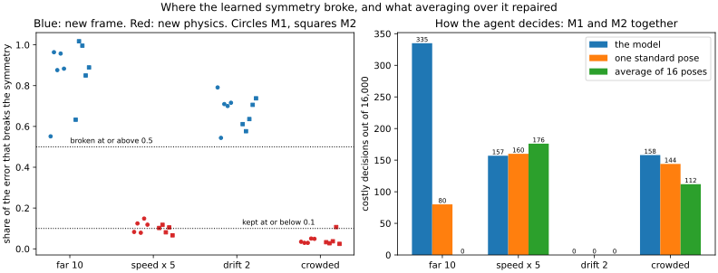

# InvariantLens

[](https://github.com/nefeMLi/InvariantLens/actions/workflows/tests.yml)

A world model predicts what happens next, and an agent uses those predictions to decide what to do. The physics here
has a simple symmetry: turn the whole scene and the outcome turns with it. A network that isn't built around that
symmetry can still learn it from data. I wanted to know what happens to the learned symmetry when the agent ends up
somewhere the training data never went, and whether anything can fix the damage without labels or retraining.

The part of a model's error that breaks the symmetry can be measured from the model alone, by asking it the same
question from 16 angles, and averaging over those angles removes it. The part that respects the symmetry can't be
seen that way. So the question is: **when a model leaves its training data, which part does its error fall into,
and what does averaging buy the agent?**

## What I found



*Left: how much of each model's one-step error breaks the symmetry, with the thresholds fixed before the test (it can
land slightly above 1, since the two parts are only exactly orthogonal over all 16 rotations). Right: costly
decisions, those ending more than 0.05 further from the goal than the best push would, out of 16,000 per shift.*

I put ten trained world models (M1 and M2, five seeds each) in four kinds of situation they had never seen, with the
physics unchanged. In two the physics was familiar but the frame was new: the scene moved 10 units from the origin,
or every disc drifted at the same extra speed. In the other two the physics was new: discs five times faster than
usual, or two discs starting closer together than any pair in training.

**The learned symmetry broke in a new frame and held for new physics, in every model.** In the new frames each
model's share of symmetry-breaking error was at least 0.54; facing new physics it was at most 0.15. All 40 model and
shift pairs landed on the predicted side. The drift case was the real test: its velocities are as far outside
training as the fast discs', so if large velocities were what kept the error hidden, it would have stayed hidden.
Instead it broke the symmetry, just like the far-away scene.

**Averaging repaired the decisions where the symmetry broke.** Far from the origin it took the models from 335
costly decisions to none. With the fast discs it made no real difference (157 before, 176 after). With the crowded
start it still cut regret by about 30%, so even a small visible part can matter for close calls.

**The repair comes from averaging, not from symmetry alone.** Asking the model once, in a standard pose, is exactly
symmetric too, at a sixteenth of the cost, but it left 80 of the 335 costly decisions. And **training on rotated
data didn't help outside the data**: M2's learned symmetry broke as much as M1's in every shift.

## How the predictions did

I fixed the predictions and their thresholds in [HYPOTHESES.md](HYPOTHESES.md) and pushed them to GitHub before
touching the test seeds. The pattern came out as predicted, but each prediction missed one exact threshold:

| Prediction | Outcome |
|---|---|
| **H8**: far from the origin the symmetry breaks and averaging repairs it; with fast discs neither | the fast discs' share was 0.103, against a bound of 0.10 |
| **H9**: the same for drift and the crowded start | averaging removed 29% of crowded's costly decisions, where I'd allowed 20% |

Both bounds came from a small development run and were too tight: there, the fast discs' share was 0.01 on 30
situations, while on 100 it was 0.10, because a few extreme speeds dominate it. The log at the end of HYPOTHESES.md
has every number, with the analyses done after the results kept separate.

## Why it might work this way

Outside their data, networks become close to linear along each direction (Xu et al., 2021). A quantity the physics
ignores, like where the scene is, picks up a small, arbitrary dependence in training that grows outside the data
with nothing to make it turn with the scene, so averaging cancels it. A quantity the physics uses, like how fast two
discs close in, is learned from data that look the same from every angle, so the network's guess stays nearly
symmetric even where it's wrong. The results fit this, but the experiment doesn't measure the mechanism directly.

## How it works

Five discs attract and repel each other. The agent pushes one of them to knock a target disc towards a goal,
choosing the best of five candidate pushes by the world model's predictions. Every candidate can be simulated for
real, so every wrong choice is known, and every situation comes in 16 copies, turned by multiples of 22.5°. M1 is a
message-passing network on absolute coordinates, M2 the same trained on randomly rotated data, and M3 is symmetric by
construction. Moving the scene or adding the drift changes nothing the physics can see (the true returns match to
10⁻⁹), while the fast discs and the crowded start, at 0.35 where training never went below 0.50, are new physics.

**Why the split is exact.** Write F for the true one-step map, F̂ for the model and e = F̂ − F. 𝒫_G asks the model
about all 16 rotations, turns each answer back and averages; S = I − 𝒫_G is the part that breaks rotation. M gives
every disc the average position and velocity error. Both are orthogonal projections over the 16 rotations of the
states seen, and they commute, so the error splits into four pieces:

| | Follows the momentum rules | Breaks them |
|---|---|---|
| **Turns with the scene** | (I − S)(I − M)e: invisible | (I − S)Me: momentum check only |
| **Breaks rotation** | S(I − M)e: rotation check only | SMe: both |

The visible part needs no ground truth. The true physics turns with the scene, so Se = SF̂. Equal masses, equal and
opposite pair forces and a push as the only outside force fix the totals one step later, P(F(s, a)) = P(s) + Δt·a and
X(F(s, a)) = X(s) + Δt·P(s) + (Δt²/2)·a, so Me comes from F̂, s and a alone. The corrected model 𝒫_G(F̂ − Me) has
exactly the invisible piece as its error, at 16 model calls per step.

## Limitations and next steps

It's a small world: five discs in 2D, models that see states rather than images, and a symmetry known in advance.
Under the new physics the costly decisions came from only a few situations per model, and the drift models made none,
so their repair shows only in regret. Averaging a model over a group (Puny et al., 2022) and canonicalising it
(Mondal et al., 2023) are established; what this adds is which extrapolation errors they remove, and what that does to
an agent's choices. Next I'd like to measure the mechanism directly, run the check on MuJoCo's Reacher, and try it on
a pretrained monocular depth network with flips as the symmetry.

## Version 1

The first version built the split and the correction and tested what each part of the error does to decisions
([HYPOTHESES.md](HYPOTHESES.md) has its own predictions and log). It found that a change in the physics can't be seen
by any check on the model, and that far from the training data most of the error turns visible and the correction
cuts wrong decisions, from 0.39% to 0.08% for M1 ([figure](figures/learned.svg)). That second result is what version
2 grew out of. The model's own margin looked like a strong warning there, but that came from how the bank was built.

## Running it

Python 3.14:

```sh
pip install -r requirements.txt
pytest tests.py
python -m experiments.diagnose --split test   # version 2; --split dev is the development data
python -m experiments.controlled              # version 1
python -m experiments.learned                 # version 1, trains the 15 models and evaluates them
python -m experiments.posthoc                 # version 1, the analyses done after its results
```

The trained models and version 1's saved evaluations are in the
[v1 release](https://github.com/nefeMLi/InvariantLens/releases/tag/v1); unzip it in the repo root and the scripts skip
whatever has already run:

```sh
curl -LO https://github.com/nefeMLi/InvariantLens/releases/download/v1/results.zip && unzip results.zip
```

Version 2 takes an hour or two on 4 CPU cores, and `--figures-only` redraws any figure from `results/*.parquet`. The
code is in `invariantlens/`, with the projections, the correction and the standard pose in `symmetry.py`:

```python
import numpy as np
from invariantlens.physics import initial_state, step, uniform_disc
from invariantlens.symmetry import corrected, signals

rng = np.random.default_rng(0)
s, a = initial_state(rng), uniform_disc(rng, 2.0, ())


def model(s, a):  # the true simulator plus a small constant drift to the right
    return step(s, a) + 0.01 * np.array([1.0, 0.0])


symmetry, balance = signals(model, s, a)  # computed without the truth
print(f"{symmetry:.4f} {balance:.4f}")  # 0.0316 0.0707: the drift breaks both rules
print(np.abs(corrected(model)(s, a) - step(s, a)).max())  # 4.4e-16: all of this error was visible
```

## References

Elesedy and Zaidi, ICML 2021, and Wang et al., NeurIPS 2023, on splitting a function by symmetry. Moskalev et al.,
ICML TAG-ML workshop 2023, on learned symmetry under shift, and Gruver et al., ICLR 2023, on measuring it. Xu et al.,
ICLR 2021, on how networks extrapolate. Puny et al., ICLR 2022, Kim et al., NeurIPS 2023, and Mondal et al., NeurIPS
2023, on making a trained model symmetric at test time. Hansen et al., ICML 2023, on enforcing conservation laws at
inference. M3 follows the EGNN of Satorras, Hoogeboom and Welling, ICML 2021.

## License

MIT, see [LICENSE](LICENSE).
